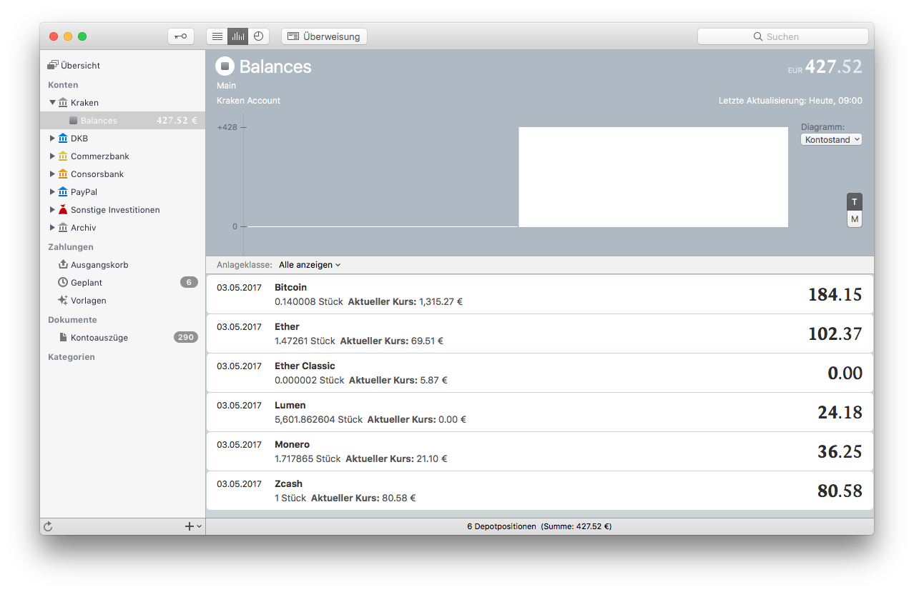

# Kraken-MoneyMoney

Fetches balances from Kraken API and returns them as securities

## Extension Setup

You can get a signed version of this extension from

* my [GitHub releases](https://github.com/aaronk6/Kraken-MoneyMoney/releases/latest) page, or
* the [MoneyMoney Extensions](https://moneymoney-app.com/extensions/) page

Once downloaded, move `Kraken.lua` to your MoneyMoney Extensions folder.

**Note:** This extension requires MoneyMoney Version 2.2.17 (284) or newer.

## Account Setup

### Kraken

1. Log in to your Kraken account
2. Go to Settings → API
3. Click “Generate New Key”
4. Under “Key Permissions”, check “Query Funds” (the others aren’t needed)
5. Click “Generate Key”

### MoneyMoney

Add a new account (type “Kraken Account”) and use your Kraken API key as username and your Kraken API secret as password.

## Screenshots

## Known Issues and Limitations

* Always assumes EUR as base currency
* Doesn’t show currencies that Kraken cannot directly exchange to EUR (e.g. Dogecoin)
